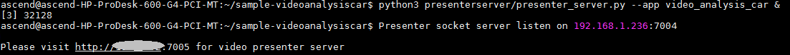
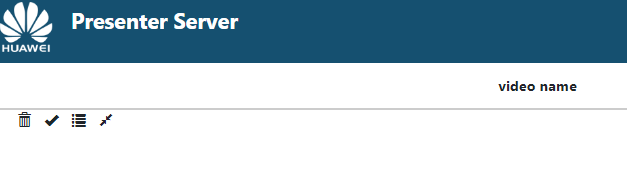

中文|[英文](README.md)

开发者将本Application部署至Atlas 200 DK或者AI加速云服务器上实现对本地mp4文件或者RTSP视频流进行解码，对视频帧中的车辆并对其属性进行预测，生成结构化信息发送至Server端进行保存、展示的功能。

## 前提条件<a name="zh-cn_topic_0167339279_section137245294533"></a>

部署此Sample前，需要准备好以下环境：

-   已完成MindSpore Studio的安装。
-   已完成Atlas 200 DK开发者板与MindSpore Studio的连接，交叉编译器的安装，SD卡的制作及基本信息的配置等。

## 软件准备<a name="zh-cn_topic_0167339279_section8534138124114"></a>

运行此Sample前，需要按照此章节获取源码包，并进行相关的环境配置。

1.  获取源码包。

    将[https://github.com/Ascend/sample-videoanalysiscar](https://github.com/Ascend/sample-videoanalysiscar)仓中的代码以MindSpore Studio安装用户下载至MindSpore Studio所在Ubuntu服务器的任意目录，例如代码存放路径为：_/home/ascend/sample-videoanalysiscar_。

2.  以MindSpore Studio安装用户登录MindSpore Studio所在Ubuntu服务器，并设置环境变量DDK\_HOME。

    **vim \~/.bashrc**

    执行如下命令在最后一行添加DDK\_HOME及LD\_LIBRARY\_PATH的环境变量。

    **export DDK\_HOME=/home/XXX/tools/che/ddk/ddk**

    **export LD\_LIBRARY\_PATH=$DDK\_HOME/uihost/lib**

    > **说明：**   
    >-   XXX为MindSpore Studio安装用户，/home/XXX/tools为DDK默认安装路径。  
    >-   如果此环境变量已经添加，则此步骤可跳过。  

    输入:wq!保存退出。

    执行如下命令使环境变量生效。

    **source \~/.bashrc**


## 部署<a name="zh-cn_topic_0167339279_section1759513564117"></a>

1.  以MindSpore Studio安装用户进入车辆检测应用代码所在根目录，如_**/home/ascend/sample-videoanalysiscar**_。
2.  <a name="zh-cn_topic_0167339279_li08019112542"></a>执行部署脚本，进行工程环境准备，包括ascenddk公共库的编译与部署、网络模型的下载、Presenter Server服务器的配置等操作，其中Presenter Server用于接收Application发送过来的数据并通过浏览器进行结果展示。

    **bash deploy.sh** _host\_ip_ **internet**

    -   _host\_ip_：对于Atlas 200 DK开发者板，即为开发者板的IP地址。对于AI加速云服务器，即为Host侧的IP地址。


    命令示例：

    **bash deploy.sh 192.168.1.2 internet**

    -   当提示“Please choose one to show the presenter in browser\(default: 127.0.0.1\):“时，请输入在浏览器中访问Presenter Server服务所使用的IP地址（一般为访问MindSpore Studio的IP地址）。
    -   当提示“Please input a absolute path to storage video analysis data:“时，请输入MindSpore Studio中绝对路径用于存储视频解析数据，此路径MindSpore Studio用户需要有读写权限，若此路径不存在，脚本会自动创建。

    如[图1](#zh-cn_topic_0167339279_fig184321447181017)所示，请在“Current environment valid ip list“中选择通过浏览器访问Presenter Server服务使用的IP地址，并输入存储视频解析数据的路径。

    **图 1**  工程部署示意图<a name="zh-cn_topic_0167339279_fig184321447181017"></a>  
    

3.  <a name="zh-cn_topic_0167339279_li499911453439"></a>启动Presenter Server。

    执行如下命令在后台启动Video Analysis应用的Presenter Server主程序。

    **python3 presenterserver/presenter\_server.py --app video\_analysis\_car &**

    > **说明：**   
    >“presenter\_server.py“在当前目录的“presenterserver“目录下，可以在此目录下执行**python3 presenter\_server.py -h**或者**python3 presenter\_server.py --help**查看“presenter\_server.py“的使用方法。  

    如[图2](#zh-cn_topic_0167339279_fig69531305324)所示，表示presenter\_server的服务启动成功。

    **图 2**  Presenter Server进程启动<a name="zh-cn_topic_0167339279_fig69531305324"></a>  
    

    使用上图提示的URL登录Presenter Server，仅支持Chrome浏览器，IP地址为[2](#zh-cn_topic_0167339279_li08019112542)中输入的IP地址，端口号默为7005，如下图所示，表示Presenter Server启动成功。

    **图 3**  主页显示<a name="zh-cn_topic_0167339279_fig64391558352"></a>  
    

    **图 4** IP地址示例 <a name="zh-cn_topic_0167333823_fig64391558353"></a>  
    

    其中：
    - Atlas 200 DK开发者板使用的IP地址为192.168.1.2（USB方式连接）。
    - Presenter Server与Atlas 200 DK通信的IP地址为UI Host服务器中与Atlas 200 DK在同一网段的IP地址，例如：192.168.1.223。
    - 通过浏览器访问Presenter Server的IP地址本示例为：10.10.0.1，由于Presenter Server与MindSpore Studio部署在同一服务器，此IP地址也为通过浏览器访问MindSpre Studio的IP。


4.  视频结构化应用支持解析本地视频和RTSP视频流。
    -   如果需要解析本地视频，需要将视频文件传到Host侧。

        例如将视频文件car.mp4上传到Host侧的“/home/HwHiAiUser/sample“目录下。

        > **说明：**   
        >支持H264与H265格式的MP4文件，如果MP4文件需要剪辑，建议使用开源工具ffmpeg，使用其他工具剪辑的视频文件ffmpeg工具可能不支持解析。  

    -   如果仅解析RTSP视频流，本步骤可跳过。


## 运行<a name="zh-cn_topic_0167339279_section6245151616426"></a>

1.  运行Video Analysis程序。

    在“/home/ascend/sample-videoanalysiscar“目录下执行如下命令运行Video Analysis应用程序。

    **bash run\_videoanalysiscarapp.sh** _host\_ip_ _presenter\_view\_appname_  _channel1_ _\[channel2\]_   &

    -   _host\_ip_：对于Atlas 200 DK开发者板，即为开发者板的IP地址。对于AI加速云服务器，即为Host侧的IP地址。
    -   _presenter\_view\_app\_name_：用户自定义的在PresenterServer界面展示的View Name，此View Name需要在Presenter Sever展示界面保持唯一。
    -   _channel1_：为Host侧的视频文件的绝对路径。
    -   _channel2_：为RTSP视频流的URL。

    命令示例如下所示：

    **bash run\_videoanalysiscarapp.sh 192.168.1.2 video /home/HwHiAiUser/sample/car.mp4 &**

2.  使用启动Presenter Server服务时提示的URL登录 Presenter Server 网站（仅支持Chrome浏览器），详细可参考[3](#zh-cn_topic_0167339279_li499911453439)。

    > **说明：**   
    >Video Analysis的Presenter Server最多支持2个_presenter\_view\_app\_name_同时显示。  

    页面左侧树结构列出了视频所属app name以及通道名，中间列出了抽取的视频帧大图以及检测出的目标小图，点击下方小图后会在右侧列出详细的推理结果、评分。

    本应用支持车辆属性检测，包括车辆品牌、车辆颜色的识别和车牌号码识别。

    > **说明：**   
    >车牌号码识别的网络模型，是通过程序自动生成的车牌作为训练集图片训练的，不是使用真实车牌图片训练的。所以该模型在识别真实车牌号码时准确度比较低，如果需要较高的准确度的模型，请自己搜集真实车牌图片作为训练集并训练。  


## 后续处理<a name="zh-cn_topic_0167339279_section1092612277429"></a>

-   **停止视频结构化应用**

    若要停止视频结构化应用程序，可执行如下操作。

    以MindSpore Studio安装用户在sample-videoanalysiscar目录下执行如下命令：

    **bash stop\_videoanalysiscarapp.sh** _host\_ip_

    _host\_ip_: 对于Atlas 200 DK开发者板，即为开发者板的IP地址。对于AI加速云服务器，即为Host的IP地址。。

    命令示例：

    **bash stop\_videoanalysiscarapp.sh** _192.168.1.2_

-   **停止Presenter Server服务**

    Presenter Server服务启动后会一直处于运行状态，若想停止视频结构化应用对应的Presenter Server服务，可执行如下操作。

    以MindSpore Studio安装用户在MindSpore Studio所在服务器中执行如下命令查看视频结构化应用对应的Presenter Server服务的进程。

    **ps -ef | grep presenter | grep video\_analysis\_car**

    ```
    ascend@ascend-HP-ProDesk-600-G4-PCI-MT:~/sample-videoanalysiscar$ ps -ef | grep presenter | grep video_analysis_car
    ascend 3655 20313 0 15:10 pts/24?? 00:00:00 python3 presenterserver/presenter_server.py --app video_analysis_car
    ```

    如上所示 _3655_ 即为车辆检测应用对应的Presenter Server服务的进程ID。

    若想停止此服务，执行如下命令：

    **kill -9** _3655_

